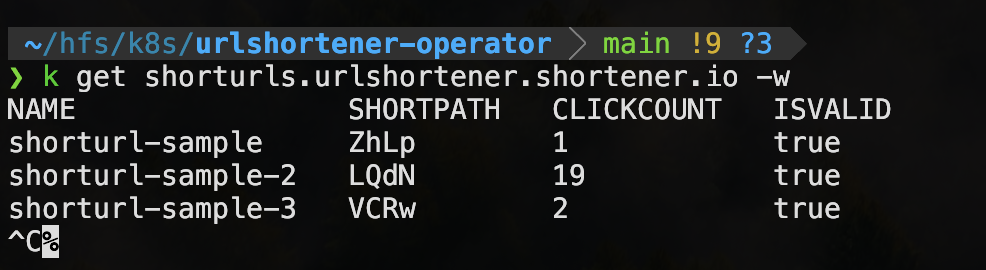

# URLShortener-operator
The **urlshortener-operator** is a Kubernetes operator that automates the deployment and management of a URL shortening service inside your cluster. It provides a custom resource definition (CRD) called **ShortURL** that allows users to easily create, update, and manage shortened URLs. The operator also keeps track of click counts and validity status for each URL, ensuring that the shortened links remain active and useful.

## Description
The urlshortener-operator simplifies the process of deploying a URL shortener service on Kubernetes. By using Kubernetes Custom Resources, this operator allows you to define a target URL (and an optional expiration time) and automatically generate a shortened URL for it. The operator continuously reconciles the resource status—updating fields like the short path, click count, and validity of the URL. With this solution, you can integrate URL shortening directly into your Kubernetes workflows and CI/CD pipelines, while benefiting from Kubernetes’ robust management and scaling features.


## **Overview**
The `urlshortener-operator` simplifies the process of running a URL shortening service in Kubernetes by:
- **Managing Custom Resources (ShortURL CRD)**: It defines a `ShortURL` custom resource that allows users to create shortened URLs and track their metadata (e.g., click count, validity).
- **Ensuring Deployment and Service Availability**: The operator reconciles the state of the URL shortener API and ensures it is running and accessible.
- **Handling Short URL Creation and Updates**: When a `ShortURL` resource is created, the operator interacts with the URL shortening API to generate a short path and update the resource’s status accordingly.
- **Periodic Reconciliation**: The operator periodically checks and updates the `ShortURL` status, including click counts and validity.


```yaml
apiVersion: urlshortener.shortener.io/v1
kind: ShortURL
metadata:
  labels:
    app.kubernetes.io/name: urlshortener-operator
  name: shorturl-sample-github
spec:
  targetURL: "https://github.com"
  expireAt: "2025-02-26T16:55:00Z"
```

after applying ShortURL manifests:



## Getting Started

### Prerequisites
- go version v1.23.0+
- docker version 17.03+.
- kubectl version v1.11.3+.
- Access to a Kubernetes v1.11.3+ cluster.

### Easy install (using Helm)
**Install the crd using helm chart in you cluster**
```sh 
cd dist/chart

helm install urlshortener-operator -f values.yaml . -n urlshortener-operator-system
```
Just do this and you are good to go.

### Install with manifests
**Build and push your image to the location specified by `IMG`:**

```sh
make docker-build docker-push IMG=<some-registry>/urlshortener-operator:tag
```

**Install the CRDs into the cluster:**

```sh
make install
```

**Deploy the Manager to the cluster with the image specified by `IMG`:**

```sh
make deploy IMG=<some-registry>/urlshortener-operator:tag
```

**Create instances of your solution**
You can apply the samples (examples) from the config/sample:

```sh
kubectl apply -k config/samples/
```

### To Uninstall
**Delete the instances (CRs) from the cluster:**

```sh
kubectl delete -k config/samples/
```

**Delete the APIs(CRDs) from the cluster:**

```sh
make uninstall
```

**UnDeploy the controller from the cluster:**

```sh
make undeploy
```

**If you installed with Helm:**

```sh
helm uninstall urlshortener-operator -n urlshortener-operator-system
```
